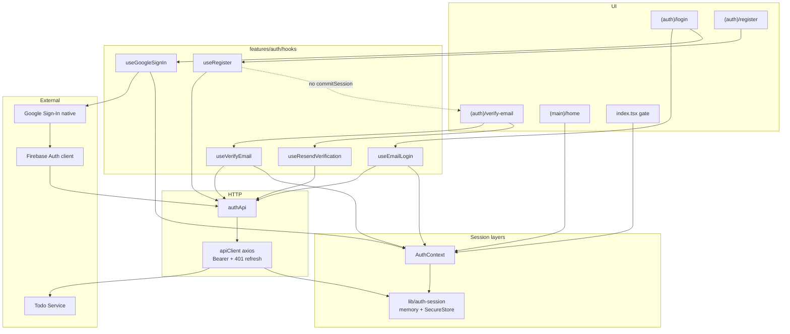
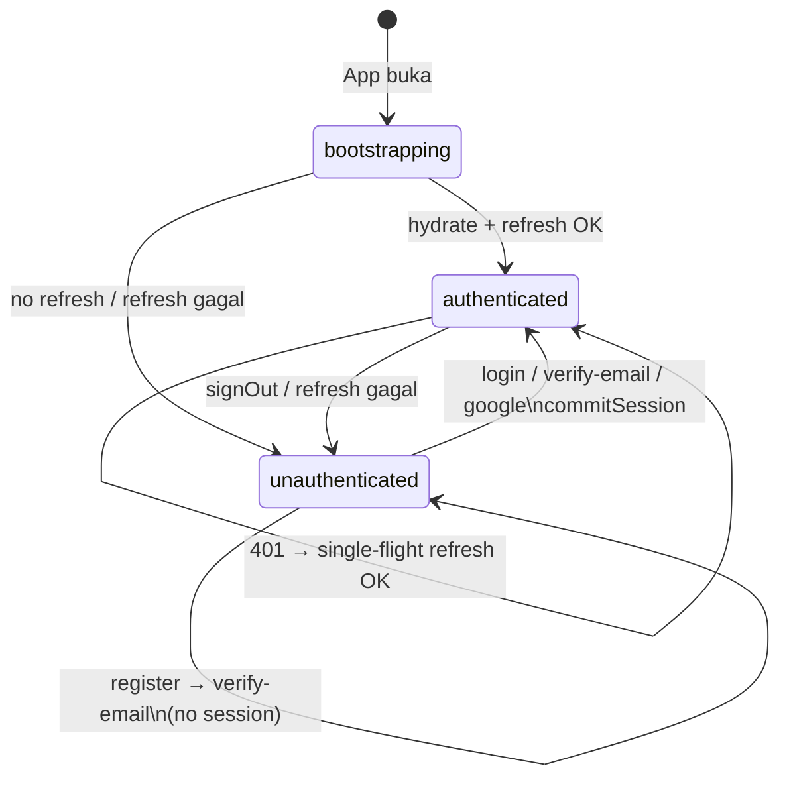
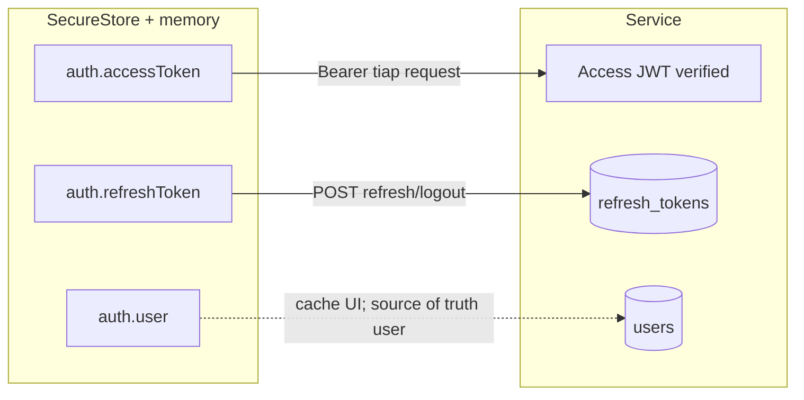
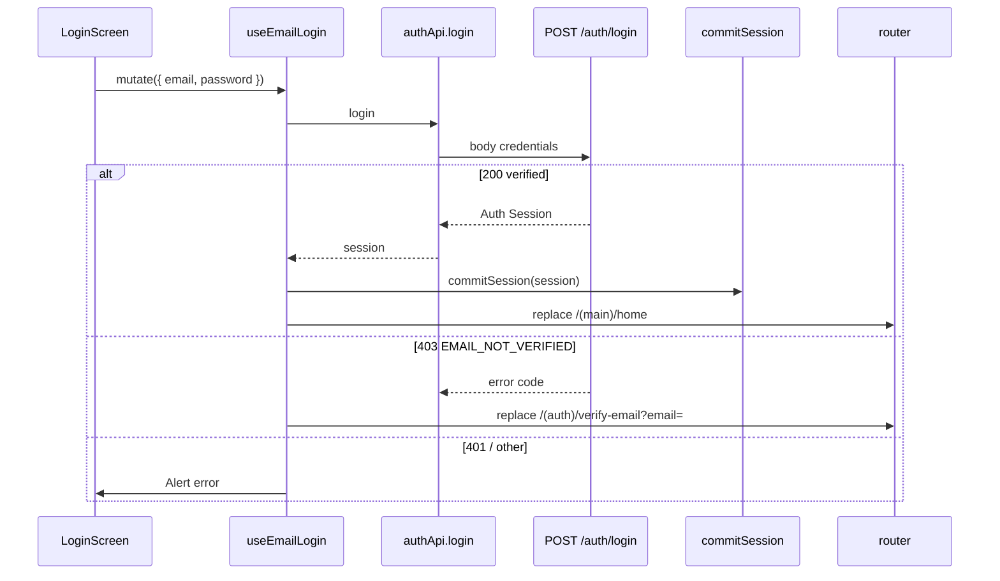
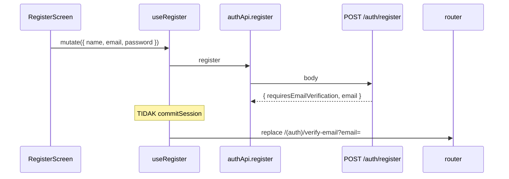
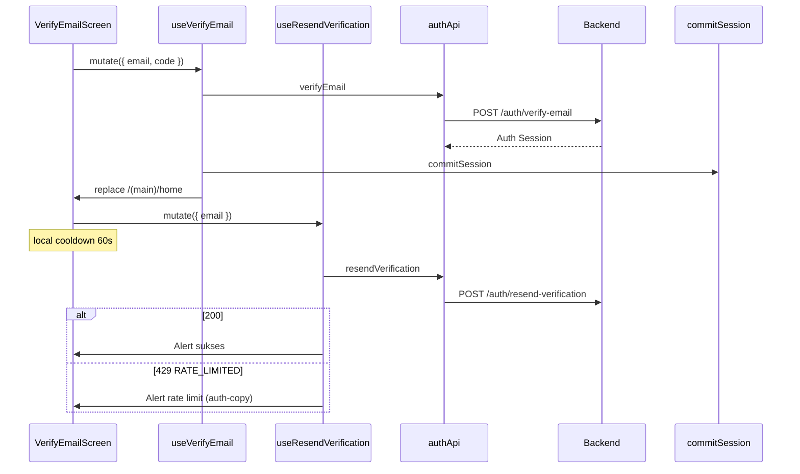
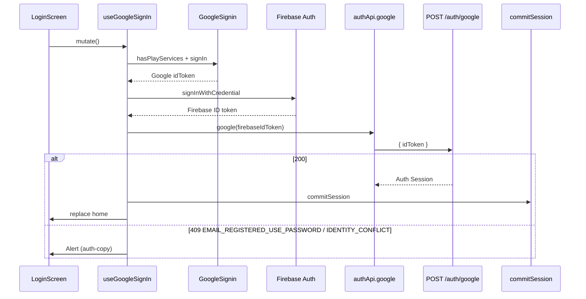
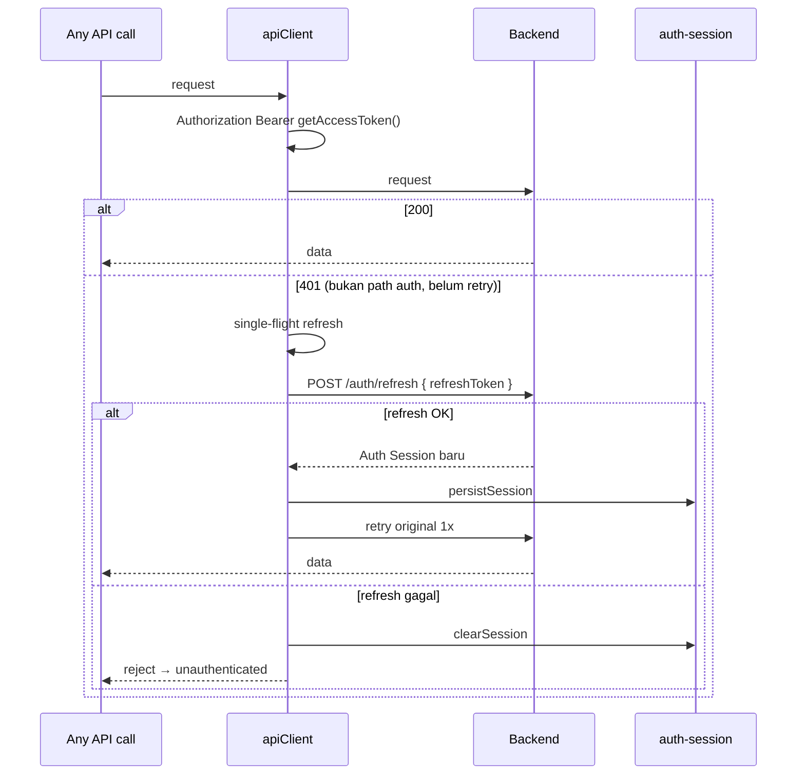

# Auth — How It Works (Client / Apps)

Dokumentasi **as-built** sistem auth di app Expo.  
Spine heading **mirror** backend: [`service/docs/auth.md`](../../service/docs/auth.md).  
Audience: onboarding full-team. Narasi Indonesia; identifier tetap English.

| Dokumen terkait                                                                              | Peran                                                           |
| -------------------------------------------------------------------------------------------- | --------------------------------------------------------------- |
| **Dokumen ini**                                                                              | Cara kerja client: hooks, session storage, interceptor, routing |
| [`../../service/docs/auth.md`](../../service/docs/auth.md)                                   | How-it-works **backend** (JWT, D1, endpoint, OTP)               |
| [`google-sign-in.md`](./google-sign-in.md)                                                   | Setup native Google (SHA-1, prebuild, troubleshooting)          |
| [`../../CONTEXT.md`](../../CONTEXT.md)                                                       | Glossary bahasa domain                                          |
| [`../../service/docs/adr/`](../../service/docs/adr/)                                         | ADR mengapa auth berbentuk seperti ini                          |
| [Scalar OpenAPI — tag auth](https://todo-service.rizky-darmarazak.workers.dev/docs#tag/auth) | Kontrak live                                                    |

Terakhir diselaraskan dengan kode: **Juli 2026**.

---

## 1. Ringkasan 30 detik

| Pertanyaan                       | Jawaban di app ini                                                                                                                                      |
| -------------------------------- | ------------------------------------------------------------------------------------------------------------------------------------------------------- |
| Siapa buktikan identitas Google? | Native Google → **Firebase exchange** → Firebase ID token                                                                                               |
| Siapa bikin Auth Session?        | Backend (`/auth/login`, `/auth/verify-email`, `/auth/google`, `/auth/refresh`)                                                                          |
| Register langsung session?       | **Tidak** — navigate `/(auth)/verify-email` (no `commitSession`)                                                                                        |
| Login unverified?                | Backend 403 `EMAIL_NOT_VERIFIED` → app buka verify-email                                                                                                |
| Body `/auth/google`?             | `{ idToken }` = **Firebase** JWT, bukan Google OAuth murni                                                                                              |
| Token untuk API?                 | Backend **Access Token** (Bearer) + **Refresh Token**                                                                                                   |
| Session disimpan di mana?        | Memory (`auth-session`) + SecureStore                                                                                                                   |
| Setelah login / verify sukses?   | `commitSession` → `router.replace('/(main)/home')`                                                                                                      |
| Restart app?                     | Hydrate SecureStore → `POST /auth/refresh` jika ada refresh; **native splash tetap tampil sampai status lepas `bootstrapping`** (`src/app/_layout.tsx`) |
| Email/password pakai Firebase?   | **Tidak** — hash di D1, session dari backend                                                                                                            |
| Firebase client untuk apa?       | **Wajib** di path Google (exchange). Bukan Bearer API                                                                                                   |

Prinsip: **Identity proof ≠ Auth Session.**  
Backend detail: [service/docs/auth.md](../../service/docs/auth.md).  
Istilah: [CONTEXT.md](../../CONTEXT.md).

---

## 2. Konsep inti

| Istilah                     | Di client                                                      |
| --------------------------- | -------------------------------------------------------------- |
| **Auth Session**            | `{ user, accessToken, refreshToken, expiresIn }` dari API      |
| **Public User**             | `user` di session / `useAuth().user` (include `emailVerified`) |
| **Access Token**            | Bearer di axios; di SecureStore `auth.accessToken`             |
| **Refresh Token**           | Untuk `/auth/refresh` & logout; key `auth.refreshToken`        |
| **Auth status**             | `bootstrapping` \| `authenticated` \| `unauthenticated`        |
| **commitSession**           | Persist + set status authenticated (setelah session sukses)    |
| **Email verification**      | Layar OTP + hooks verify/resend; **bukan** Auth Session        |
| **Register pending**        | `{ requiresEmailVerification: true, email }` — no tokens       |
| **Identity proof (Google)** | Firebase ID token dikirim sekali ke `/auth/google`             |

Jangan sebut “Firebase session” untuk state app — session app = **Auth Session** backend.  
Jangan `commitSession` setelah register — hanya setelah verify/login/google/refresh.

---

## 3. Arsitektur (diagram)

### 3.1 Big picture (client)



### 3.2 State machine Auth status (client)



### 3.3 Mapping storage ↔ model backend

Backend ERD: [service/docs/auth.md §3.3](../../service/docs/auth.md#33-erd-auth).

| Client (SecureStore) | Isi                                | Backend                          |
| -------------------- | ---------------------------------- | -------------------------------- |
| `auth.accessToken`   | JWT access                         | di-sign service; **tidak** di D1 |
| `auth.refreshToken`  | JWT refresh                        | hash + `jti` di `refresh_tokens` |
| `auth.user`          | JSON Public User (`emailVerified`) | subset row `users`               |



---

## 4. Alur login

### 4.1 Email login



### 4.2 Register (no session)



### 4.3 Verify email + resend



Copy ID terpusat di `src/features/auth/auth-copy.ts` (bukan full i18n lib).

### 4.4 Google (client)



> Backend memverifikasi **Firebase** ID token.  
> Jangan kirim Google OAuth murni (`iss: accounts.google.com`).  
> Setup native: [`google-sign-in.md`](./google-sign-in.md).  
> BE flow (no silent link): [service/docs/auth.md §4.4](../../service/docs/auth.md#44-google-no-silent-link).

### 4.5 Logout

```text
Home "Keluar" → signOut()
  → POST /auth/logout { refreshToken }   // best-effort
  → clearSession()                       // memory + SecureStore
  → GoogleSignin.signOut()               // best-effort
  → status = unauthenticated
  → router.replace('/(auth)/login')
```

### 4.6 Cold start / boot

```text
App buka → AuthProvider status = bootstrapping
  → hydrateSessionFromStorage()
  → jika tidak ada refreshToken → clearSession → unauthenticated
  → jika ada → POST /auth/refresh → persistSession → authenticated
  → gagal refresh → clearSession → unauthenticated

Path `/` (src/app/index.tsx)
  → bootstrapping → spinner
  → authenticated → /(main)/home
  → unauthenticated → /(auth)/login
```

---

## 5. Session & JWT (sudut client)

### 5.1 Dua lapisan (sengaja)

| Layer                 | Isi                                                   | Konsumen                               |
| --------------------- | ----------------------------------------------------- | -------------------------------------- |
| `lib/auth-session.ts` | access + refresh + cached user (memory + SecureStore) | axios interceptor, boot, persist/clear |
| `AuthContext`         | `user`, `status`, `commitSession`, `signOut`          | UI, gate, greeting                     |

Axios **tidak** bergantung React context. Token live di module non-React.

### 5.2 SecureStore keys

| Key                 | Value                                        |
| ------------------- | -------------------------------------------- |
| `auth.accessToken`  | JWT string                                   |
| `auth.refreshToken` | JWT string                                   |
| `auth.user`         | JSON `PublicUser` (termasuk `emailVerified`) |

### 5.3 AuthContext surface

```ts
status: 'bootstrapping' | 'authenticated' | 'unauthenticated'
user: PublicUser | null
isAuthenticated: boolean  // status === 'authenticated'
commitSession(session: AuthSession): Promise<void>
signOut(): Promise<void>
```

### 5.4 API session module

| Fungsi                                                 | Peran                                |
| ------------------------------------------------------ | ------------------------------------ |
| `getAccessToken` / `getRefreshToken` / `getCachedUser` | Baca memory                          |
| `persistSession(session)`                              | Memory + SecureStore + notify        |
| `clearSession()`                                       | Hapus semua + notify                 |
| `hydrateSessionFromStorage()`                          | SecureStore → memory (**tanpa** API) |
| `subscribeSession(listener)`                           | AuthContext sync                     |

### 5.5 Request + 401 refresh



Path yang **tidak** memicu auto-refresh:

`/auth/refresh`, `/auth/login`, `/auth/register`, `/auth/google`, `/auth/logout`, `/auth/verify-email`, `/auth/resend-verification`

**Kenapa refresh langsung di `client.ts`?**  
Hindari circular import `auth.api` ↔ `apiClient`.  
**Belum ada (v1):** proactive refresh sebelum `expiresIn` — refresh driven by 401.

Claims JWT (isi token): lihat [service/docs/auth.md §5](../../service/docs/auth.md#5-session--jwt).

---

## 6. Endpoint / kontrak

Base URL axios: `https://todo-service.rizky-darmarazak.workers.dev`  
(`src/api/client.ts`)

| Method | Path                        | Body                        | Response data                             |
| ------ | --------------------------- | --------------------------- | ----------------------------------------- |
| `POST` | `/auth/register`            | `{ name, email, password }` | `RegisterPendingVerification` (no tokens) |
| `POST` | `/auth/verify-email`        | `{ email, code }`           | `AuthSession`                             |
| `POST` | `/auth/resend-verification` | `{ email }`                 | `{ ok: true }` (unwrap void di client)    |
| `POST` | `/auth/login`               | `{ email, password }`       | `AuthSession`                             |
| `POST` | `/auth/google`              | `{ idToken }` Firebase JWT  | `AuthSession`                             |
| `POST` | `/auth/refresh`             | `{ refreshToken }`          | `AuthSession`                             |
| `POST` | `/auth/logout`              | `{ refreshToken }`          | void (best-effort)                        |
| `GET`  | `/auth/me`                  | Bearer                      | `PublicUser`                              |

### Envelope sukses (session)

```ts
{
  success: true;
  requestId: string;
  data: {
    user: PublicUser;
    accessToken: string;
    refreshToken: string;
    expiresIn: number; // detik, contoh 900
  }
}
```

### Envelope register pending

```ts
{
  success: true;
  data: {
    requiresEmailVerification: true;
    email: string;
  }
  requestId: string;
}
```

`authApi.register` **tidak** memanggil unwrap session — validasi `requiresEmailVerification`.  
`authApi.verifyEmail` / login / google / refresh **unwrap** ke `AuthSession`.

### `authApi` methods

```ts
authApi.register(payload); // → RegisterPendingVerification
authApi.verifyEmail({ email, code }); // → AuthSession
authApi.resendVerification({ email }); // → void
authApi.login(payload); // → AuthSession
authApi.google(idToken); // → AuthSession
authApi.refresh(token); // → AuthSession
authApi.logout(token); // → void
authApi.me(); // → PublicUser
```

### Error envelope

```ts
{
  success: false;
  error: { code: string; message: string };
  requestId?: string;
}
```

UI:

- `getApiErrorMessage(error)` → Alert generik
- `getApiErrorCode(error)` → branch khusus (`EMAIL_NOT_VERIFIED`, `RATE_LIMITED`, Google 409, …)
- `messageForAuthCode(code)` dari `auth-copy.ts` untuk copy ID stabil

Kode relevan FE (`AuthErrorCode`):

| Code                                                  | Client behavior               |
| ----------------------------------------------------- | ----------------------------- |
| `EMAIL_NOT_VERIFIED`                                  | Navigate verify-email (login) |
| `INVALID_OTP` / `OTP_EXPIRED` / `OTP_MAX_ATTEMPTS`    | Alert di verify screen        |
| `RATE_LIMITED`                                        | Alert resend cooldown         |
| `EMAIL_REGISTERED_USE_PASSWORD` / `IDENTITY_CONFLICT` | Alert Google                  |
| `EMAIL_ALREADY_REGISTERED`                            | Alert register                |

### Yang tidak dikirim (login path)

- Firebase token sebagai `POST /auth/login { token }` (endpoint lama)
- Google OAuth idToken murni ke `/auth/google` tanpa exchange Firebase
- Expect session tokens dari `POST /auth/register`

---

## 7. Data model (client)

Tidak ada DB lokal auth. Model TypeScript: `src/features/auth/types.ts`.

```ts
type PublicUser = {
  id: string;
  email: string;
  name: string;
  role: 'user' | 'admin';
  firebaseUid: string | null;
  emailVerified: boolean;
  createdAt: string;
  updatedAt: string;
};

type AuthSession = {
  user: PublicUser;
  accessToken: string;
  refreshToken: string;
  expiresIn: number;
};

type RegisterPendingVerification = {
  requiresEmailVerification: true;
  email: string;
};
```

Persist: lihat §3.3 dan §5.2.

---

## 8. Security invariants (client)

1. Jangan log access/refresh token.
2. Jangan log OTP di production builds.
3. Session sensitif di **SecureStore**, bukan AsyncStorage biasa.
4. Bearer hanya lewat `apiClient` interceptor — jangan hardcode header di call site.
5. Path auth (termasuk verify/resend) tidak ikut auto-refresh loop.
6. 401 refresh **single-flight** (satu promise bersama).
7. Setelah auth sukses pakai **`replace`**, bukan `push` (back stack).
8. Register **tidak** `commitSession`.
9. Firebase client = identity Google saja, bukan storage session app.
10. Jangan parse JWT di UI untuk otorisasi — percaya `useAuth().user` + API.

---

## 9. Peta file (apps)

```text
src/
├── app/
│   ├── _layout.tsx              # AuthProvider + Stack (incl. verify-email)
│   ├── index.tsx                # Auth gate `/`
│   ├── (auth)/login.tsx
│   ├── (auth)/register.tsx
│   ├── (auth)/verify-email.tsx  # OTP UI + resend cooldown
│   └── (main)/
│       ├── _layout.tsx          # Guard
│       └── home.tsx
├── context/AuthContext.tsx
├── lib/
│   ├── auth-session.ts
│   ├── auth-token.ts            # re-export thin
│   ├── api-error.ts             # getApiErrorMessage / getApiErrorCode
│   └── firebase.ts              # WAJIB path Google
├── api/client.ts                # Bearer + 401 refresh
└── features/auth/
    ├── types.ts
    ├── auth-copy.ts             # ID strings (verify, resend, Google 409)
    ├── api/auth.api.ts
    └── hooks/
        ├── useGoogleSignIn.ts
        ├── useEmailLogin.ts
        ├── useRegister.ts
        ├── useVerifyEmail.ts
        └── useResendVerification.ts
```

| Layer             | Jangan taruh di sini               |
| ----------------- | ---------------------------------- |
| `auth.api.ts`     | UI, navigasi, Google SDK           |
| `auth-session.ts` | React hooks / navigasi             |
| `AuthContext`     | Panggilan Google SDK / form fields |
| Hooks auth        | Layout screen / styling form       |
| Screens           | Logika token & HTTP mentah         |
| `api/client.ts`   | Business login                     |
| `lib/firebase.ts` | Session storage / Bearer API       |

### Routing & guard

| Route                  | Perilaku                                       |
| ---------------------- | ---------------------------------------------- |
| `/`                    | Spinner bootstrapping; lalu home atau login    |
| `/(auth)/login`        | Form email + Google; jika authenticated → home |
| `/(auth)/register`     | Register form → verify-email (no session)      |
| `/(auth)/verify-email` | OTP + resend; params `email`; success → home   |
| `/(main)/*`            | unauthenticated → login                        |
| `/(main)/home`         | Profile + Keluar                               |

### Cara menambah login method baru

```text
1. Dapatkan credential / identity proof (native / form)
2. session = await authApi.<method>(...)   // harus Auth Session
3. await commitSession(session)
4. router.replace('/(main)/home')
```

Untuk flow yang **belum** session (mirip register): navigate ke intermediate screen, **jangan** commit.  
Contoh session-path: `useAppleSignIn.ts` mirror `useEmailLogin` / `useGoogleSignIn`.  
Endpoint backend harus ada dulu — lihat service docs.

---

## 10. Debug / ops (client + pointer BE)

### App / client

| Gejala                       | Cek                                                                             |
| ---------------------------- | ------------------------------------------------------------------------------- |
| Unmatched route di start     | `app/index.tsx` path `/`                                                        |
| Stuck spinner                | Network `/auth/refresh` + SecureStore keys                                      |
| Google `DEVELOPER_ERROR`     | [`google-sign-in.md`](./google-sign-in.md) SHA-1, webClientId type 3            |
| `idToken` null               | `GoogleSignin.configure({ webClientId })`                                       |
| `/auth/google` 401 signature | Pastikan **Firebase** JWT (`iss: securetoken.google.com/...`)                   |
| Google 409                   | Email sudah password account — pakai password + verify; explicit link belum ada |
| Email 401                    | Password / belum register / Google-only user                                    |
| Email 403 → verify screen    | Expected for unverified; cek OTP di log BE (local)                              |
| Register lalu langsung home  | Bug: jangan `commitSession` di useRegister                                      |
| OTP gagal terus              | `INVALID_OTP` / expired / max attempts; resend                                  |
| Resend disabled              | Local 60s cooldown di verify-email screen                                       |
| Shape response mismatch      | `auth.api.ts` + `types.ts` (`emailVerified`, pending register)                  |
| Login OK tapi API 401        | `commitSession`? `getAccessToken()`? refresh gagal?                             |
| Restart jadi logout          | SecureStore; refresh expired/revoked                                            |
| `useAuth` error              | Komponen di luar `AuthProvider`                                                 |

### Backend (sering 500 production)

Detail: [service/docs/auth.md §10](../../service/docs/auth.md#10-debug--ops).

```bash
cd service && npx wrangler tail --search 'http_error'
cd service && npx wrangler tail --search 'email_verification_otp'  # local LogEmailSender
```

| Log / response                                 | Fix tipikal                          |
| ---------------------------------------------- | ------------------------------------ |
| `HMAC key length (0)`                          | `wrangler secret put JWT_SECRET`     |
| `no such table: refresh_tokens`                | `npm run db:migrate:auth:prod`       |
| `no such table: email_verification_challenges` | `npm run db:migrate:email:prod`      |
| Invalid token signature Google                 | Firebase JWT + `FIREBASE_PROJECT_ID` |
| OTP tidak terkirim prod                        | `EMAIL_PROVIDER=resend` + secrets    |

---

## 11. Referensi

| Butuh                     | Path / URL                                                                                                                   |
| ------------------------- | ---------------------------------------------------------------------------------------------------------------------------- |
| Backend how-it-works      | [`../../service/docs/auth.md`](../../service/docs/auth.md)                                                                   |
| Glossary                  | [`../../CONTEXT.md`](../../CONTEXT.md)                                                                                       |
| ADR auth                  | [`../../service/docs/adr/`](../../service/docs/adr/)                                                                         |
| ADR email hard gate       | [`../../service/docs/adr/0005-email-verification-hard-gate.md`](../../service/docs/adr/0005-email-verification-hard-gate.md) |
| ADR no silent Google link | [`../../service/docs/adr/0006-no-silent-google-link.md`](../../service/docs/adr/0006-no-silent-google-link.md)               |
| Setup Google native       | [`google-sign-in.md`](./google-sign-in.md)                                                                                   |
| Hook Google               | `src/features/auth/hooks/useGoogleSignIn.ts`                                                                                 |
| Hook email                | `src/features/auth/hooks/useEmailLogin.ts`                                                                                   |
| Hook register             | `src/features/auth/hooks/useRegister.ts`                                                                                     |
| Hook verify               | `src/features/auth/hooks/useVerifyEmail.ts`                                                                                  |
| Hook resend               | `src/features/auth/hooks/useResendVerification.ts`                                                                           |
| Verify screen             | `src/app/(auth)/verify-email.tsx`                                                                                            |
| Auth copy (ID)            | `src/features/auth/auth-copy.ts`                                                                                             |
| AuthContext               | `src/context/AuthContext.tsx`                                                                                                |
| Session storage           | `src/lib/auth-session.ts`                                                                                                    |
| Firebase init             | `src/lib/firebase.ts`                                                                                                        |
| HTTP auth                 | `src/features/auth/api/auth.api.ts`                                                                                          |
| Axios + refresh           | `src/api/client.ts`                                                                                                          |
| Scalar Auth API           | https://todo-service.rizky-darmarazak.workers.dev/docs#tag/auth                                                              |
| Logger service            | [`../../service/docs/logger.md`](../../service/docs/logger.md)                                                               |
| Run Android (Google)      | `npx expo run:android` (bukan Expo Go)                                                                                       |

### Roadmap client (ringkas)

| Item                                         | Status          |
| -------------------------------------------- | --------------- |
| Google → Firebase → `/auth/google`           | ✅              |
| Email login + register                       | ✅              |
| Email verification UI (OTP + resend)         | ✅              |
| Register → verify (no session)               | ✅              |
| Login `EMAIL_NOT_VERIFIED` → verify          | ✅              |
| AuthContext + boot refresh                   | ✅              |
| SecureStore                                  | ✅              |
| 401 single-flight refresh                    | ✅              |
| Root gate + protect `(main)`                 | ✅              |
| Proactive refresh sebelum `expiresIn`        | ⬜              |
| Role-based UI                                | ⬜              |
| Explicit Google link after password          | ⬜ backend + FE |
| Google tanpa Firebase client (jika BE ganti) | ⬜ opsional     |

### Prinsip desain (ingat)

1. Identity provider ≠ session app.
2. Satu model **Auth Session** untuk semua metode yang sudah verified.
3. Register / pending verification **bukan** Auth Session.
4. API tipis; hook orkestrasi; context state; screen UX.
5. `replace` setelah auth.
6. Interceptor baca token non-React.
7. 401 refresh single-flight di `client.ts`.
8. Boot tunggu `status !== 'bootstrapping'`.
9. Firebase = identity Google saja.
